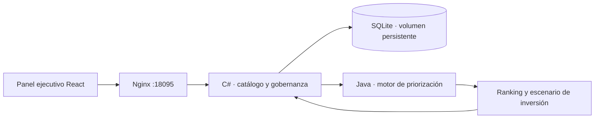

# Enterprise Architecture Hub

[](https://github.com/jorgefprietol/enterprise-architecture-hub/actions/workflows/ci.yml)

Plataforma de arquitectura empresarial que conecta objetivos estratégicos con capacidades de negocio, evidencia de madurez, decisiones tecnológicas e iniciativas de inversión. Desarrollada con **C# / ASP.NET Core 10, Java 21 / Spring Boot y React / TypeScript**.

El caso ficticio **Meridian Commerce** representa una operación de comercio omnicanal. Sus metas, costos, evidencias y equipos son datos de demostración; no se presentan como resultados obtenidos en una empresa real.

## Producto

| Función               | Resultado                                                                                                  |
| --------------------- | ---------------------------------------------------------------------------------------------------------- |
| Estrategia            | Objetivos, indicadores, metas, responsables y relación ponderada con capacidades                           |
| Modelo de capacidades | Estrategia → dominio → subdominio → capacidad → subcapacidad; búsqueda por alcance y navegación contextual |
| Evaluación            | Madurez L1–L5 de personas, procesos, datos y tecnología; evidencia y evaluador obligatorios                |
| Priorización          | Matriz impacto × oportunidad, ranking explicable y simulación presupuestaria                               |
| Trazabilidad          | Objetivo ↔ capacidad ↔ procesos, datos, aplicaciones y tecnología; estados actual, objetivo y retiro     |
| Equipos               | Responsables y tipos de equipo: alineado al flujo, plataforma, habilitador y subsistema especializado      |
| Hoja de ruta          | Trimestres, inversión, resultados esperados, estados y dependencias sin ciclos                             |
| Gobernanza            | Decisiones con contexto y compromisos, controles de calidad, auditoría y exportación CSV de 12 columnas    |

Todos los catálogos admiten altas, edición y eliminación. Las referencias protegen los registros relacionados y los cambios actualizan las vistas derivadas. [Práctica de arquitectura, revisión del mapa y gobierno](docs/practice.md).

## Inicio rápido

Requisitos: Docker Engine y Docker Compose v2.

```powershell
Copy-Item .env.example .env
# Editar EDITOR_TOKEN en .env con una clave aleatoria larga.
docker compose up -d --build --wait
```

Abrir [http://localhost:18095](http://localhost:18095). Para editar, usar «Configurar clave de edición» e introducir el valor local de `EDITOR_TOKEN`. La clave solo se guarda en memoria del navegador; no se incluye en el código ni en la imagen.

```bash
cp .env.example .env
# Configurar EDITOR_TOKEN antes de iniciar.
docker compose up -d --build --wait
```

El catálogo persiste en el volumen `catalog-data`. `docker compose down` conserva los datos. El puerto público del entorno local se vincula exclusivamente a `127.0.0.1`; C# y Java solo exponen puertos en la red interna.

## Arquitectura



**C#** es dueño del catálogo y de las escrituras transaccionales con auditoría. Valida alcances, nombres duplicados, evidencia, referencias y dependencias. **Java** calcula prioridades de forma determinista y sin estado; recibe una proyección del catálogo mediante un contrato HTTP. **React** integra las dos responsabilidades detrás de un mismo origen, sin duplicar datos ni reglas de decisión. [Diseño y decisiones](docs/architecture.md).

## Cálculo de prioridad

```text
Madurez     = (personas + proceso + datos + tecnología) / 4
Brecha      = max(0, madurez objetivo − madurez actual)
Impacto     = ingresos × 0.30 + costo × 0.25 + riesgo × 0.25 + cliente × 0.20
Oportunidad = brecha / 4 × viabilidad
Puntaje     = impacto × oportunidad × min(1, suma de contribuciones estratégicas)
```

Impactos y viabilidad usan una escala de 1 a 5. La oportunidad ocupa 0 a 5. Se considera apuesta estratégica un impacto ≥ 3.5 y una oportunidad ≥ 2. Los empates se ordenan por identificador. Para simular presupuesto se recorre el ranking y se incluye cada inversión estimada que cabe en el saldo. Es una heurística explicable; no es una optimización de cartera y no incorpora dependencias en la asignación. Las dependencias se validan al guardar la hoja de ruta.

## Validación y entrega

```bash
dotnet test csharp/Architecture.Tests/Architecture.Tests.csproj
mvn -B -f java/pom.xml verify
cd web
npm ci
npm test
npm run build
npx playwright install chromium
npm run test:e2e
```

Las pruebas de escritura E2E requieren `EDITOR_TOKEN` en el entorno de ejecución. `python scripts/smoke.py` verifica la integración desplegada C# → Java. [Guía operativa](docs/operations.md).

GitHub Actions ejecuta pruebas de ambos servicios, compilación y pruebas de React, auditoría de dependencias npm, pruebas E2E sobre Docker Compose y reinicio del catálogo. Solo después publica **tres imágenes en GHCR** con etiquetas `latest` y `sha-<commit>`, SBOM y procedencia de construcción. Las pull requests ejecutan validaciones sin publicar imágenes. Dependabot revisa cambios de dependencias semanalmente.

## API

| Método       | Ruta                            | Uso                                                        |
| ------------ | ------------------------------- | ---------------------------------------------------------- |
| GET          | `/health`                       | Estado de almacenamiento                                   |
| GET          | `/api/workspace`                | Catálogo, relaciones y últimos 100 eventos                 |
| GET          | `/api/priorities?budget=200000` | Ranking y escenario calculados por Java                    |
| GET          | `/api/validation`               | Hallazgos de calidad del modelo                            |
| GET          | `/api/export/capabilities.csv`  | Mapa contextual de 12 columnas, con protección de fórmulas |
| POST         | `/api/{collection}`             | Crear registro                                             |
| PUT / DELETE | `/api/{collection}/{id}`        | Editar o eliminar registro                                 |
| GET          | `/openapi/v1.json`              | Contrato generado del catálogo                             |

Colecciones: `goals`, `nodes`, `alignments`, `assessments`, `assets`, `traces`, `initiatives`, `decisions`. Las escrituras requieren `X-Editor-Token`. El contrato de entrada al motor Java se describe en [contratos](docs/contracts.md).

## Experiencia técnica demostrable

Diseño e implementación de una plataforma de arquitectura empresarial orientada a capacidades, con servicios en C# y Java, interfaz React, persistencia relacional, priorización explicable, trazabilidad estratégica, contenedores y entrega automatizada con GitHub Actions.

[Descripción para portafolio](docs/portfolio.md) · [Límites operativos y seguridad](SECURITY.md) · [Licencia MIT](LICENSE)
